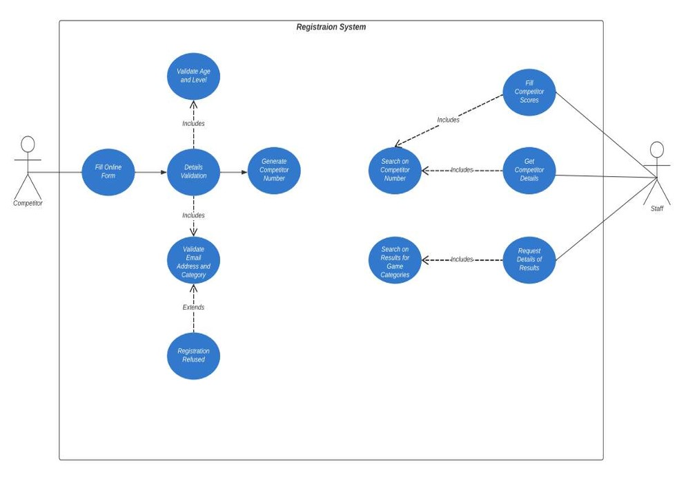
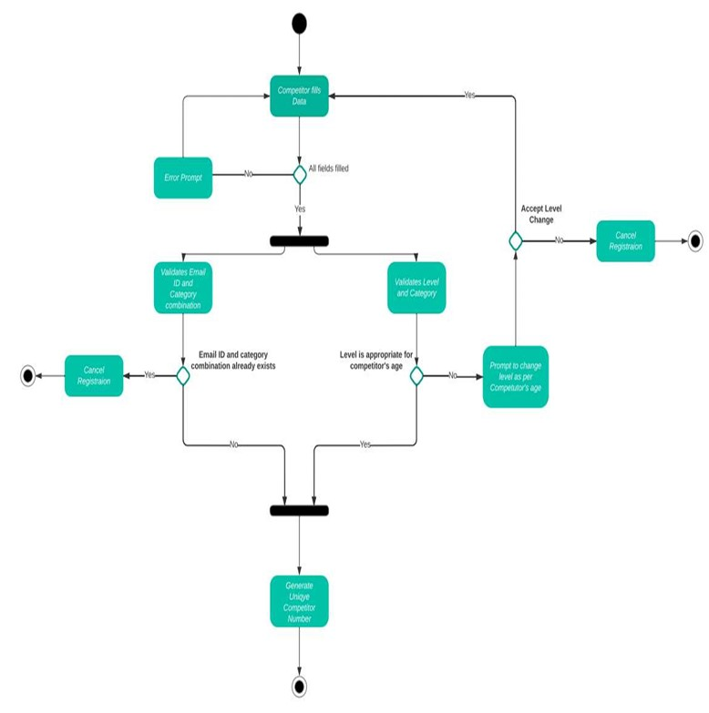
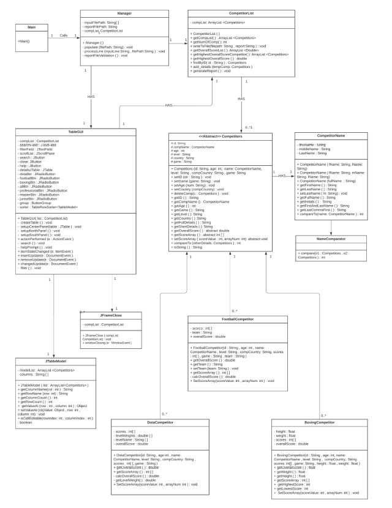

# Registration-System


## Project Overview
This project consists of two key components:

1. **Registration System**: A use case and activity diagram for a competitor registration system.
2. **Java Project**: A GUI-based Java application that manages competitors for three different games (Dota 2, Football, and Boxing), allowing users to sort, filter, and edit scores.

## Table of Contents
- [Project Overview](#project-overview)
- [Features](#features)
- [Diagrams](#diagrams)
- [Installation](#installation)
- [Usage](#usage)
- [Technologies Used](#technologies-used)
- [References](#references)

## Features
### Registration System
- Competitors register through an online system by entering their details.
- System verifies competitor information (email, game category, and age level).
- Generates a unique competitor number upon successful registration.
- Handles errors such as blank fields, duplicate registrations, and invalid age levels.

### Java Project
- Manages competitors across three games.
- Computes scores based on specific rules:
  - **Dota 2**: Weighted average based on competitor level.
  - **Football**: Average of all scores.
  - **Boxing**: Average excluding the highest and lowest scores.
- GUI allows users to:
  - View and modify competitor details (except game category and number).
  - Sort data by clicking column headers.
  - Filter data using radio buttons or search text fields.
- Input validation and error handling prevent invalid user inputs.

## Diagrams
The project includes:
- **Use Case Diagram**: Illustrates the competitor registration process.
  
  
  
- **Activity Diagram**: Shows the flow of registration from input to confirmation.
  
  
  
- **Class and Inheritance Diagrams**: Represent Java object relationships.
  
  

## Installation
### Prerequisites
Ensure you have the following installed:
- Java Development Kit (JDK 8 or higher)
- An IDE (Eclipse, IntelliJ IDEA, or NetBeans)

### Steps
1. Clone the repository:
   ```sh
   git clone https://github.com/Vk-Singh/Registration-System
   ```
2. Open the project in your Java IDE.
3. Compile and run the Java files.

## Usage
1. **Registration System**:
   - Follow the use case and activity diagrams to understand competitor registration.
2. **Java Application**:
   - Run the GUI-based Java program.
   - Use sorting, filtering, and editing features.
   - View and modify competitor scores dynamically.

## Technologies Used
- **Java (Swing)**: GUI Development
- **Object-Oriented Programming (OOP)**: Inheritance, Polymorphism
- **UML Diagrams**: Use Case, Activity, Class Diagrams


## References
1. [Java Swing Components - Oracle Docs](https://docs.oracle.com/javase/tutorial/uiswing/components/)
2. [Fred Swartz - Java GUI Tutorials](https://www.fredswartz.com)


